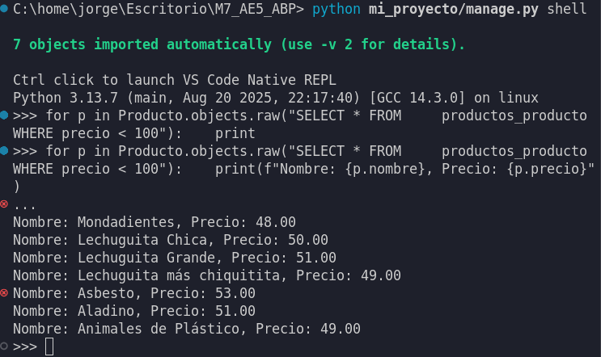
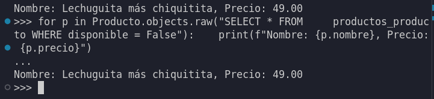

# Actividad de Aprendizaje - Consultas en Django

Este documento describe cómo un estudiante humilde y sencillo de Python y Django resolvió los ejercicios de consultas a la base de datos utilizando Django.

## ¿Cómo se probaron los códigos?

Para probar que los códigos funcionaran, el estudiante usó la "shell" de Django. Esta es una herramienta que permite ejecutar comandos de Python que entienden cómo funciona el proyecto.

Para iniciar esta shell, el estudiante  utilizó el siguiente comando en la terminal:

```bash
python3 mi_proyecto/manage.py shell
```

---

### 1. Creación del Modelo y Primera Consulta

Lo primero que se hizo fue crear el modelo `Producto` que se pedía en el ejercicio. Un modelo es como un plano que le dice a la base de datos cómo guardar la información.

**Modelo `Producto`:**

Este código define el modelo con los campos `nombre`, `precio` y `disponible`.

```python
# Este archivo está en: productos/models.py
from django.db import models

class Producto(models.Model):
    nombre = models.CharField(max_length=100, unique=True)
    precio = models.DecimalField(max_digits=10, decimal_places=2)
    disponible = models.BooleanField(default=True)
```

**Obtener todos los productos:**

Después de crear el modelo, el estudiante usó el ORM de Django para traer todos los productos guardados en la base de datos. Para esto, se usa `.all()`.

```python
# Se importa el modelo para poder usarlo
from productos.models import Producto

# Se piden todos los objetos (registros) del modelo Producto
todos_los_productos = Producto.objects.all()

# Con un bucle, se muestra cada producto encontrado
for p in todos_los_productos:
    print(p.nombre)
```

---

### 2. Usando Filtros para Buscar Datos

En esta parte, el estudiante aprendió a usar filtros para buscar productos que cumplieran con ciertas condiciones. Para esto se usa `.filter()`.

**Productos con precio mayor a 50:**

```python
# La condición precio__gt=50 significa "precio greater than 50"
productos_caros = Producto.objects.filter(precio__gt=50)
```

**Productos cuyo nombre empieza con "A":**

```python
# La condición nombre__startswith='A' busca texto que empieza con esa letra
productos_con_a = Producto.objects.filter(nombre__startswith='A')
```

**Productos que están disponibles:**

```python
# Aquí se buscan los productos donde el campo 'disponible' sea verdadero
productos_disponibles = Producto.objects.filter(disponible=True)
```

---

### 3. Haciendo una Consulta SQL Directa

Además del ORM, Django puede ejecutar consultas SQL escritas a mano. El estudiante usó el método `.raw()` para hacer una consulta que buscara productos con un precio menor a 100.

```python
from productos.models import Producto

# Se escribe la consulta SQL como un texto
consulta_sql = "SELECT * FROM productos_producto WHERE precio < 100"

# Se ejecuta la consulta con .raw()
productos_baratos = Producto.objects.raw(consulta_sql)

# Se recorren los resultados para verlos
for p in productos_baratos:
    print(f"{p.nombre} cuesta {p.precio}")
```

---

### 4. Entendiendo el Mapeo de Consultas

Finalmente, el estudiante investigó cómo funciona `.raw()`. Descubrió que Django necesita "mapear" (o convertir) las filas de la base de datos en objetos del modelo `Producto`.

La regla más importante para que este mapeo funcione es que la consulta SQL debe traer la **clave primaria** (la columna `id`) de la tabla.

*   **¿Por qué `SELECT *` funciona?** Porque el `*` le dice a la base de datos que traiga todas las columnas, incluyendo la columna `id`.

    ```python
    # Esta consulta funciona porque el * incluye el id
    Producto.objects.raw("SELECT * FROM productos_producto")
    ```

*   **¿Qué pasaría si no se incluye el `id`?** Si se hace una consulta pidiendo solo algunas columnas (como `nombre` y `precio`) pero se olvida pedir el `id`, Django no sabría cómo armar los objetos del modelo y la consulta fallaría.

    ```python
    # Esta consulta daría error porque le falta la columna 'id'
    # Producto.objects.raw("SELECT nombre, precio FROM productos_producto")
    ```
---


### 5. Realizando Búsquedas de Índice

Los índices son estructuras de datos que aceleran las consultas a la base de datos. Se menciona que automáticamente Django crearía un índice en la BBDD incluso si NO se solicita. No obstante ello, por control de la data del modelo se recomienda la existencia de un índice, el cual puede facilitar distintos tipos de búsquedas y consultas. Por ejemplo, se podría modificar el modelo para hacer que la dimensión 'nombre' valga como indice (index). Es relevante señalar que al operar como índice, sus valores serán configurados como 'únicos', not null. Esto, ya que su función como índice será la de ser un identificador de esa fila ('row') de datos. El formato dimensional en general opera con dimensiones dispuestas horizontalmente (fila de encabezados) y verticalmente (filas de datos). Cada fila de datos corresponde a un objeto de la clase producto. El índice hace la función de referirse a cada fila de datos ~ instancia. Por ejemplo

```python
class Producto(models.Model):
    nombre = models.CharField(max_length=100, db_index=True)
```
db_index=True opera para señalar que esa columna(nombre) es un índice de la base de datos.

Las Bases de Datos pueden operar relacionadas, similares a un BUSCARV en MS Excel. Esto se puede implementar a través de las relaciones de llaves primárias (PrimaryKey)y llaves foráneas(ForeignKey). Como decíamos en el párrafo anterior, las PrimaryKeys se establecen implícitamente, pero si se quisiera literalizar, se haría a través de una definición del tipo:
```python
class Producto(models.Model):
    id = models.AutoField(primary_key=True)
    [...]
```
Vista completa:

```python
class Venta(models.Model):
    # Primary Key EXPLÍCITA:
    id = models.AutoField(primary_key=True)  # ← ¡ESTE ES LA PK!

    # Foreign Keys
    vendedor = models.ForeignKey(Vendedor, on_delete=models.PROTECT)
    producto = models.ForeignKey(Producto, on_delete=models.PROTECT)
    fecha_venta = models.DateTimeField(auto_now_add=True)
    cantidad = models.IntegerField()

    class Meta:
        ordering = ['-fecha_venta']

    def __str__(self):
        return f"Venta #{self.id} - {self.producto.nombre}
```

---

### 6. Exclusión de Campos del Modelo

Es relevante señalar que _no siempre es necesario_ traer todos los campos de la base de datos para optimizar las consultas. Para excluir un campo que no se necesita, se puede utilizar el método `.defer()`.

```python
productos_sin_disponible = Producto.objects.defer('disponible')
```

Esto mejora la eficiencia, ya que Django no gasta recursos en cargar datos que no se van a usar. Si más tarde se intenta acceder al campo excluido (por ejemplo, `producto.disponible`), Django lo recuperará de la base de datos en ese momento, haciendo una nueva consulta solo para ese dato.

### 7. Añadiendo Anotaciones en Consultas

Luego, se investigó cómo añadir campos calculados directamente en una consulta. Para esto, se usó `.annotate()`. Se calculó un nuevo campo llamado `precio_con_impuesto`, añadiendo un 19% al precio original.

```python
from django.db.models import F

# Se usa F() para referirse al valor del campo 'precio' en la base de datos
productos_con_impuesto = Producto.objects.annotate(
    precio_con_impuesto=F('precio') * 1.19
)

# Al revisar el resultado, cada producto tiene el nuevo campo calculado
for p in productos_con_impuesto:
    print(f"{p.nombre} - Precio: {p.precio}, Precio con 19% imp: {p.precio_con_impuesto:.2f}")
```

Para poder hacer el cálculo, fue necesario usar `F('precio')`. Se aprendió que `F()` permite usar el valor de un campo del propio modelo dentro de una consulta, sin tener que traerlo primero a la memoria de Python.

### 8. Pasando Parámetros a `raw()`

Para mejorar la seguridad, se modificó la consulta `raw()` para usar parámetros. Esto es muy importante para prevenir ataques de "inyección SQL".

```python
valor_limite = 100

# En lugar de poner 100 en la consulta, se usa %s y se pasa el valor en una lista
productos_baratos = Producto.objects.raw(
    'SELECT * FROM productos_producto WHERE precio < %s', [valor_limite]
)
```

El beneficio de esta técnica es que el motor de la base de datos se encarga de "limpiar" el valor, asegurando que no contenga código malicioso. Esta sería la forma correcta y más segura de hacer consultas `raw()`.

### 9. Ejecutando SQL Personalizado Directamente

Conforme la bibliografía, es relevante señalarq que para ejecutar comandos que no devuelven registros del modelo (como `INSERT`, `UPDATE` o `DELETE`), es más directo usar `connection.cursor()`.

```python
from django.db import connection

# Se usa 'with' para asegurar que el cursor se cierre correctamente
# Recoerdar que 'with' abre el cursos y lo cierra automáticamente al salir del bloque.

with connection.cursor() as cursor:
    cursor.execute("DELETE FROM productos_producto WHERE nombre = %s", ['Producto a eliminar'])
```

Se concluyó que esta técnica es recomendable cuando se necesita hacer operaciones masivas de datos o cuando no se necesita que Django convierta los resultados en objetos (modelos), lo que puede ser más rápido.

### 10. Conexiones y Cursores

Profundizando en el tema anterior, además, se analizó el uso de una conexión manual. Al usar `connection.cursor()`, se obtiene un "cursor", que es  un puntero que tanto ayudaa ejecutar comandos además de moverse por los resultados dentro de la base de datos.

```python
from django.db import connection

with connection.cursor() as cursor:
    cursor.execute("SELECT nombre, precio FROM productos_producto WHERE disponible = %s", [True])
    
    for fila in cursor.fetchall():
        print(f"Nombre: {fila[0]}, Precio: {fila[1]}")
```
En el segmento de código anterior, téngase presente que `.fetchall()` trae todos los resultados como una lista de tuplas. <br>La ventaja es el control total y la posible ganancia de velocidad. La gran desventaja frente al ORM es que se pierde todo el poder de Django: no hay objetos, no hay manejo de relaciones ni validaciones. Solo se obtienen tuplas de datos crudos.

### 11. Invocación a Procedimientos Almacenados

Finalmente, se investigó sobre los procedimientos almacenados. Se aprendió que son como "funciones" o "recetas" de comandos SQL que se guardan en la base de datos para ser reutilizadas. Para usarlos desde Django, primero habría que crear uno en la base de datos.

**Ejemplo de Procedimiento Almacenado (SQL):**

```sql
-- Este código se ejecutaría una vez en la base de datos para crear el procedimiento
CREATE PROCEDURE obtener_productos_por_precio(IN precio_maximo DECIMAL(10,2))
BEGIN
    SELECT * FROM productos_producto WHERE precio < precio_maximo;
END
```

**Invocación desde Django:**

Una vez creado, se puede llamar usando `cursor.callproc()`.

```python
from django.db import connection

with connection.cursor() as cursor:
    # Se llama al procedimiento por su nombre y se le pasan los parámetros
    cursor.callproc('obtener_productos_por_precio', [100])
    
    # Se recuperan los resultados que el procedimiento generó
    for resultado in cursor.fetchall():
        print(resultado)
```

Esto es útil para encapsular lógica de negocio compleja directamente en la base de datos y llamarla de forma simple desde la aplicación.

El estudiante se llama **Jorge Cárdenas Yañez**. Aún le cuesta un poco entender Django.